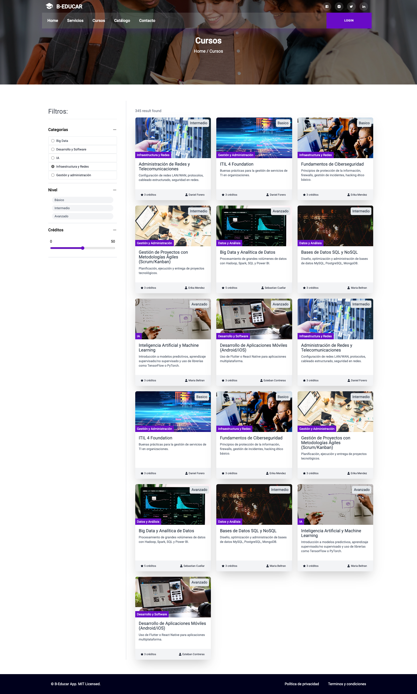

# 📘 Course Page

Aplicación ReactJS + TypeScript que consume la Course API y gestiona el estado global mediante Redux Toolkit.
Este proyecto está orientado al **registro de usuarios, asignaciones de planes y matriculación de cursos**. 

---

## 📂 Estructura del Proyecto

```
src/
 ├── app/                      # Configuración global de Redux Toolkit (store, reducers)
 │    ├── api/                
 │    │     ├── authApi.ts     # Endpoints de autenticación (signup, login, logout)
 │    │     ├── userApi.ts     # Endpoints de usuarios 
 │    │     ├── courseApi.ts   # Endpoints de cursos
 │    │     ├── planApi.ts     # Endpoints de planes
 │    │     └── assignApi.ts   # Endpoints de asignacions de planes
 │    └── store.ts             # Configuración del store
 ├── pages/
 │    ├── Home.tsx             # Vista Home
 │    ├── Register.tsx         # Vista Registro
 │    ├── Login.tsx            # Vista Login
 │    ├── CourseDetail.tsx     # Vista Detalle de curso
 │    └── Welcome.tsx          # Vista Perfil (logueado)
 ├── routes/
 │    ├── AppRouter.tsx        # Configuración de rutas
 │    └── PrivateRoute.tsx     # Validación de vistas protegidas
 ├── components/
 │    ├── ui/                  # Componentes UI
 │    └── shared/              # Componentes UI
 ├── features/
 │    └── auth/
 │         └── authSlice.ts    # Gestión de tokens y crendeciales
 ├── hooks/
 │    ├── Title.tsx             # Configuración titulo por vista
 │    └── useCourseAssigment.ts # Validación (matricular usuario a curso)
 ├── utils/
 │    └── formatDate.ts        # Funciones de fechas
 ├── index.css                 # Hoja de estilos 
 └── main.tsx                  # Archivo inicial
```

---

## 🛠️ Tecnologías y Librerías

- **React 19** → Libreria web para interfaces
- **TypeScript** → Tipado estático
- **Redux Toolkit** → Manejo del estado global
- **TailwindCSS** → Estilos css
- **Yup + Hook-form** → Validación de formularios
- **React icons** → Iconos

---

## ⚙️ Instalación y usos

1. **Clonar el repositorio**  
   ```bash
   git clone https://github.com/brian-esguerra/course-front
   cd course-front
   ```

2. **Instalar dependencias**  
   ```bash
   npm install
   ```

3. **Configurar variables de entorno** en `.env`:  
   ```env
   VITE_API_URL=http://localhost:3000/api
   ```

4. **Iniciar el proyecto en modo desarrollo:**  
   ```bash
   npm run dev
   ```

5. **Generar build para producción:**  
   ```bash
   npm run build
   ```

Aplicación corriendo en: [http://localhost:5173](http://localhost:5173)  

---

## 📡 Integración con la API

Se conecta al backend **Course API** para:
- Listar cursos y el detalle
- Listar planes
- Registrar usuarios (SignUp)
- Loguear usuarios (SignIn)
- Asignar créditos
- Consultar créditos disponibles
- Matricular usuarios a cursos

---

## 🖼️ Capturas de la aplicación

### Pantalla de Inicio


### Pantalla de Cursos


### Detalle del Curso


### Registro

